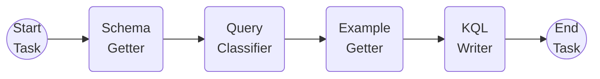

# Introduction to Agentic AI solutions with AutoGen

## 1.0 - What is Agentic System

An agentic system is an autonomous artificial intelligence designed to operate independently, making decisions and performing tasks without human intervention.


## 2.0 - What is AutoGen (0.5.1)

A framework for building AI agents and applications.

Reference:
- [AutoGen](https://microsoft.github.io/autogen/stable/index.html)

### 2.1 - What is AutoGenChat

AgentChat is a high-level API for building multi-agent applications. It is built on top of the autogen-core package. 

Reference:
- [AutoGen AgentChat](https://microsoft.github.io/autogen/stable/user-guide/agentchat-user-guide/index.html)

#### 2.1.1 - Top concepts

- Agent definition: It is important to know how to configure the agents. Agents will have different capabilities such as having tools, having different system prompts, terminating messages, etc.
- Termination: If not careful, an Agent conversation could run "forever". Special attention needs to be paid when to terminate a conversation.
- Agent Team: There are different types of Agent team presets such as RoundRobinChat, SelectorGroupChat, MagenticOneGroupChat, and others.
- Message observability and handling: It is important to know how to tap into the Agent conversation.

### 2.2 - What is AutoGen Core

AutoGen core offers an easy way to quickly build event-driven, distributed, scalable, resilient AI agent systems.

Reference:
- [AutoGen Core](https://microsoft.github.io/autogen/stable/user-guide/core-user-guide/index.html)

## 3.0 - Demos

### 3.1 - Requirements

Create a `.env` file with the following settings:

```bash
AZURE_OPENAI_ENDPOINT=https://<NAME>.openai.azure.com/
AZURE_OPENAI_API_KEY=<API_KEY>
AZURE_OPENAI_API_VERSION=2024-10-21
```

Reference:
- [Sample `.env` file](https://github.com/msalemor/agentic-intro-autogen/blob/main/.env-sample)

### 3.2 - Writer/Reviewer without AutoGen

This sample uses the completion API to write a story, then review the story, then modify the story according to the suggested changes, and finally perform a final review.

[Writer/Reviewer - No Agents](https://github.com/msalemor/agentic-intro-autogen/blob/main/demos/writer-reviewer.py)

### 3.3 - Write/Reviewer - Poor man's Agentic system

This sample uses the a poor man's Agentic framework to write a story, then review the story, then modify the story according to the suggested changes. It is design to highligh some important Agentic concepts in a framework.

[Writer/Reviewer - Poor man's Agentic system](https://github.com/msalemor/agentic-intro-autogen/blob/main/demos/writer-reviewer-poor.py)

### 3.4 - Writer/Reviewer with AutoGen

This sample uses AutoGen to create two agents participating in a RoundRobinChat. There is the writer agent and the reviewer agent. The writer agent initially creates a story, and passes the story to the reviewer for a review. The reviewer either suggests more changes or approves the story. If the reviewer suggests more changes, it passes the story back to the write for a rewrite. The write rewrite the story and passes the story to the reviewer. The process continues until the reviewer approves the story and terminates the conversation with an `Approve` message.

[Agentic - Writer/Reviewer](https://github.com/msalemor/agentic-intro-autogen/blob/main/demos/writer-reviewer-agents.py)

### 3.5 - KQL Writer with AutoGen (more advanced solution)

In this example, for Agents are used to generate KQL from natural language:

Agents:
- Schema getter agent: This agent is configured to analyze the query and us a tool to simulate getting the schema from participating tables or functions.
- Query classifier agent: This agent is configured to classify the KQL query as: single-table, multi-table single-cluster, multi-table multi-cluster.
- Example generator agent: This agent is configured to generate a sample query based on the query classification.
- KQL writer agent: This agent take the schema and the sample and generates a final query and terminates the conversation.

#### 3.5.1 - Diagram



[Agentic - KQL Writer](https://github.com/msalemor/agentic-intro-autogen/blob/main/demos/kql-write-agents.py)

### 3.6 - Autogen Studio

Reference:
- [AutoGen Studio](https://microsoft.github.io/autogen/stable/user-guide/autogenstudio-user-guide/index.html)
